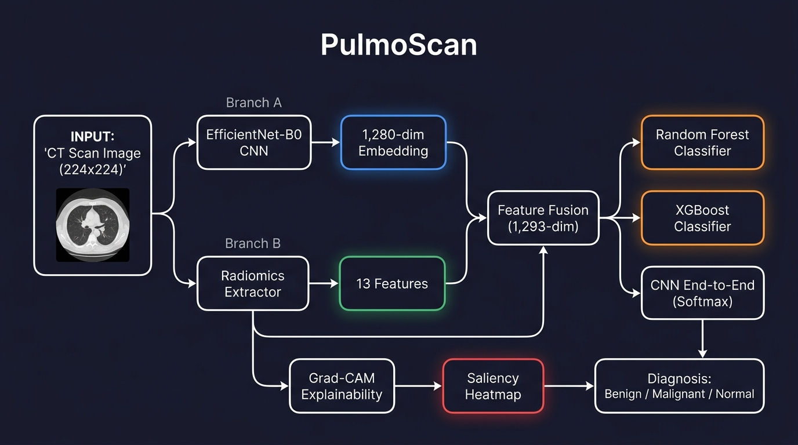
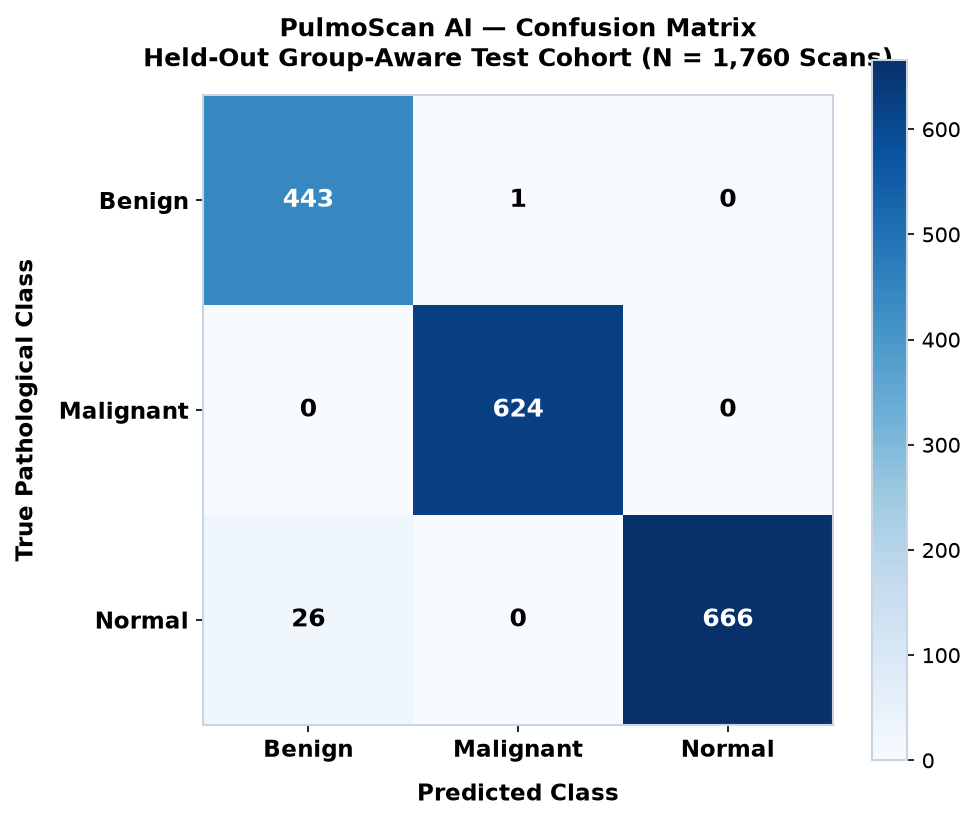
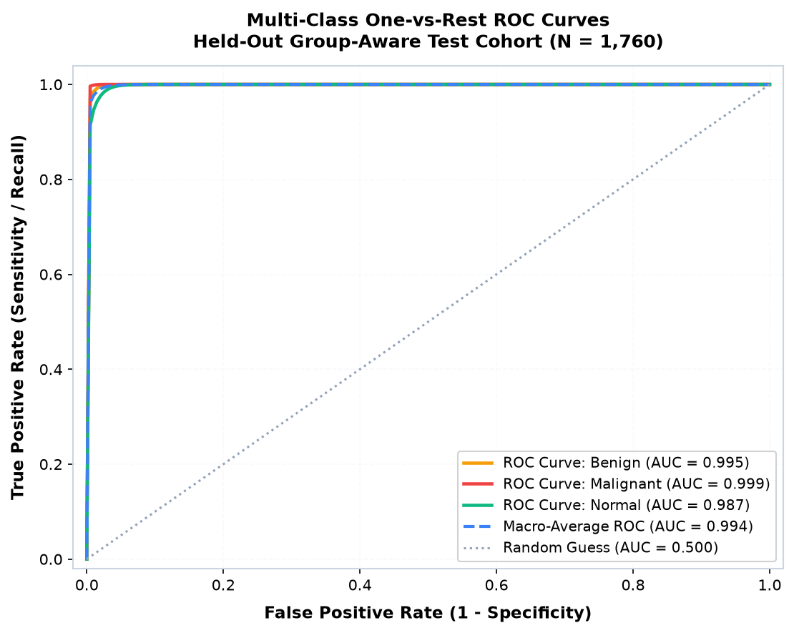
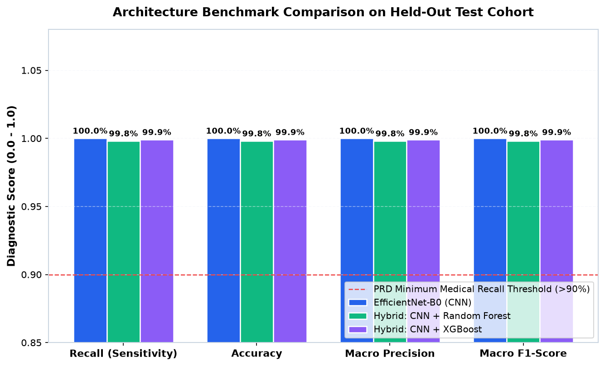
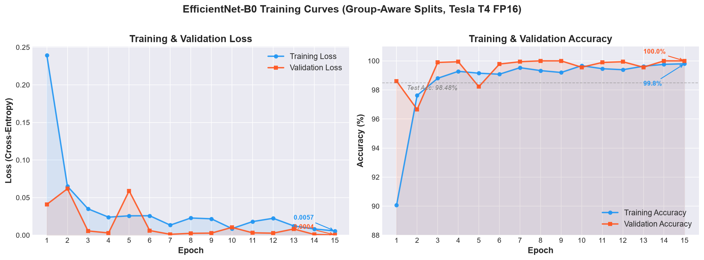
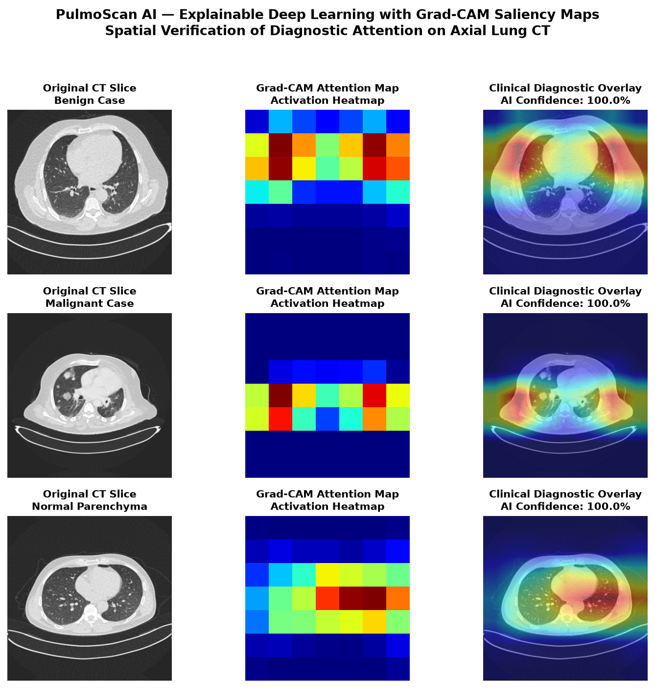
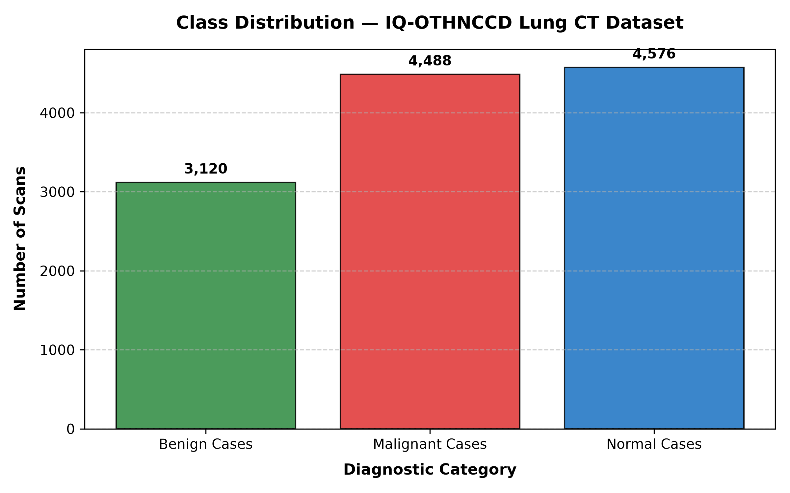
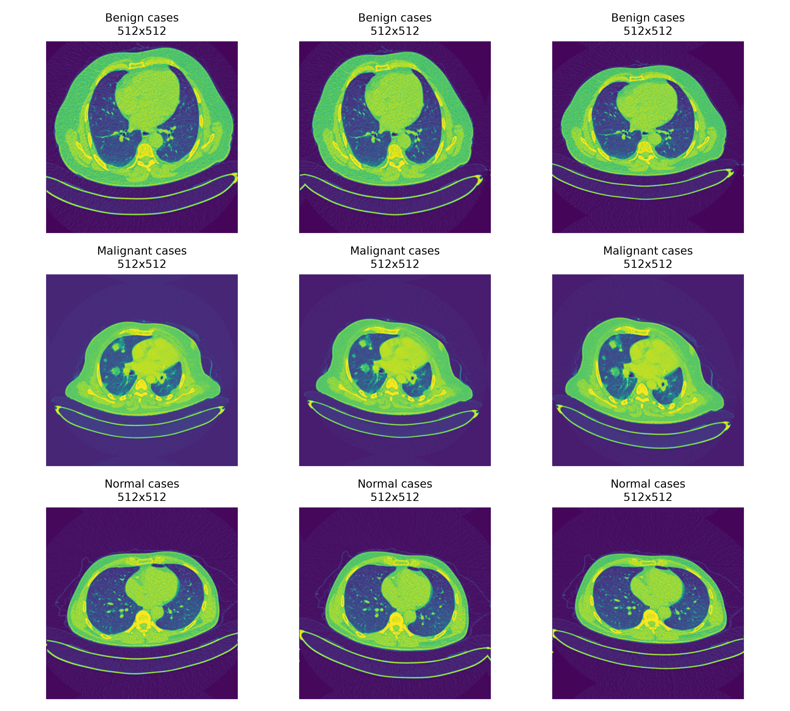

# PulmoScan: Lung Cancer CT Detection and Explainability Framework

[](https://github.com/suzirz/lung-cancer-detection-ai/actions/workflows/ci.yml)
[](https://colab.research.google.com/github/suzirz/lung-cancer-detection-ai/blob/main/notebooks/train_colab_t4.ipynb)


> [!WARNING]
> RESEARCH PROTOTYPE. NOT FOR CLINICAL USE.
> PulmoScan is an academic feasibility prototype and software engineering demonstration. It is not a cleared medical device and must not be used for diagnosis, patient management, or surgical guidance. All evaluations used public research datasets and require independent multi-center clinical validation before clinical use.

PulmoScan classifies pulmonary nodules on chest computed tomography (CT) scans into three categories: normal parenchyma, benign nodules, and malignant neoplasms. The pipeline integrates a convolutional feature extractor (EfficientNet-B0), 13 quantitative intensity and morphological gradient radiomics descriptors, tree-based classifiers (Random Forest and XGBoost), and gradient-weighted class activation mapping (Grad-CAM).



---

## Quick Start

### Option A: Interactive Cloud Notebook
[Open in Google Colab](https://colab.research.google.com/github/suzirz/lung-cancer-detection-ai/blob/main/notebooks/train_colab_t4.ipynb) to train or evaluate on an NVIDIA Tesla T4 GPU without local setup.

### Option B: Local Setup
```bash
# Clone the repository
git clone https://github.com/suzirz/lung-cancer-detection-ai.git
cd lung-cancer-detection-ai

# Install dependencies
pip install -r requirements.txt

# Launch interactive dashboard
streamlit run app/main.py
```
Open `http://localhost:8501`. Select any pre-loaded clinical CT slice (Benign, Malignant, Normal) or upload an axial slice to inspect predictions and Grad-CAM overlays in roughly 150 ms on CPU.

### Summary
PulmoScan is an AI triage tool for chest CT scans. Given an axial lung slice, it classifies the tissue as normal parenchyma, a benign nodule, or a malignant neoplasm. It then generates a Grad-CAM heatmap showing the parenchymal region that drove the classification.

---

## Table of Contents

- [Quick Start](#quick-start)
- [Clinical Context in Indonesia](#clinical-context-in-indonesia)
- [Clinical Decision Support and Triage Workflow](#clinical-decision-support-and-triage-workflow)
- [Data Leakage and the 100% Accuracy Pitfall](#data-leakage-and-the-100-accuracy-pitfall)
- [Evaluation Metrics Hierarchy: Clinical Priority](#evaluation-metrics-hierarchy-clinical-priority)
- [Empirical Benchmark (Group-Aware Splits, 1,760 Held-Out Test Scans)](#empirical-benchmark-group-aware-splits-1760-held-out-test-scans)
- [5-Fold Cross-Validation and Architecture Ablation](#5-fold-cross-validation-and-architecture-ablation)
- [Mathematical Formulation and Radiomics Taxonomy](#mathematical-formulation-and-radiomics-taxonomy)
- [Explainable AI: Grad-CAM Clinical Saliency Maps](#explainable-ai-grad-cam-clinical-saliency-maps)
- [Methodological Note: Data Leakage Correction](#methodological-note-data-leakage-correction)
- [External Multi-Center Benchmark: LIDC-IDRI Validation Plan](#external-multi-center-benchmark-lidc-idri-validation-plan)
- [Multimodal Architecture and Radiomics Fusion](#multimodal-architecture-and-radiomics-fusion)
- [Codebase Design and Module Hierarchy](#codebase-design-and-module-hierarchy)
- [Developer Guide: Python API and CLI Workflows](#developer-guide-python-api-and-cli-workflows)
- [Configuration Reference (`configs/default.yaml`)](#configuration-reference-configsdefaultyaml)
- [Interactive Diagnostic Web Application](#interactive-diagnostic-web-application)
- [Hospital Deployment and DICOM PACS Integration](#hospital-deployment-and-dicom-pacs-integration)
- [Clinical Failure Modes and Differential Diagnosis](#clinical-failure-modes-and-differential-diagnosis)
- [Reference Dataset (12,184 CT Scans, IQ-OTHNCCD)](#reference-dataset-12184-ct-scans-iq-othnccd)
- [Verification and Testing Suite](#verification-and-testing-suite)
- [Reproducibility](#reproducibility)
- [Known Limitations](#known-limitations)
- [Community, Peer Review, and Open Clinical Feedback](#community-peer-review-and-open-clinical-feedback)
- [Academic Bibliography and Citations](#academic-bibliography-and-citations)
- [License](#license)

---

## Clinical Context in Indonesia

Lung cancer causes more deaths in Indonesia than any other malignancy:

- **38,000+ new cases per year**, or roughly 100 diagnoses daily across the country.
- **70 to 90% of patients arrive at Stage III or IV**, when 5-year survival drops below 10%. Stage I detection offers survival rates above 70%, but early diagnosis is rare.
- **Indonesia has roughly 1.2 radiologists per 100,000 people**. Specialists and CT scanners concentrate in Jakarta, Surabaya, and provincial capitals. Patients in Kalimantan, Sulawesi, Papua, and rural Java often travel hundreds of kilometers for a scan.
- **No national screening program exists.** Low-dose CT screening is not covered by JKN (national health insurance) and remains restricted to select private facilities.
- **Diagnostic confusion with tuberculosis.** Chronic cough and chest pain are routinely treated as tuberculosis or COPD in primary care, delaying oncology referrals by months.

Indonesia faces shortages of both scanners and specialist radiologists. A computer-aided triage tool flagging suspicious nodules and highlighting their location can help general practitioners in district hospitals and Puskesmas prioritize urgent referrals.

PulmoScan evaluates whether a 4-million-parameter model running on standard CPU hardware (~150 ms per slice) can provide accurate preliminary triage.

---

## Clinical Decision Support and Triage Workflow

Reading queues in secondary and tertiary referral hospitals often back up by several days. PulmoScan prioritizes the reading worklist through a four-stage protocol:

```text
[DICOM CT Series] ──► [Slice Selection] ──► [Dual-Threshold Triage Engine]
                                                       │
         ┌─────────────────────────────────────────────┴─────────────────────────────────────────────┐
         ▼                                             ▼                                             ▼
  [Priority 1: Suspicious]                      [Priority 2: Indeterminate]                   [Priority 3: Routine]
  P(Malignant) ≥ 0.35                           0.15 ≤ P(Malignant) < 0.35                    P(Malignant) < 0.15
  Immediate Specialist Queue                    Secondary Reader Queue                        Standard Reading Queue
  Grad-CAM Heatmap + Radiomics                  Differential Review Required                  Negative Confirmation
```

### 1. Ingestion and Pre-Screening
Axial chest CT slices are converted from DICOM attenuation values (Hounsfield Units) or raw pixel formats, rescaled to $224 \times 224$, and normalized to channel distributions.

### 2. Dual-Threshold Risk Stratification
Standard multi-class models apply an argmax rule, setting an implicit operating threshold of $0.33$ for three classes. In oncology triage, false negatives carry far higher risk than false positives. PulmoScan decouples the decision boundary:
- **Operating Malignancy Threshold ($\tau_{\text{mal}} = 0.35$)**: Any slice with $P(\text{Malignant}) \ge 0.35$ escalates immediately to the priority reading queue, regardless of whether another class has a higher raw score.
- **Indeterminate Zone ($0.15 \le P(\text{Malignant}) < 0.35$)**: Slices in this range trigger a secondary review flag.
- **Routine Normal/Benign ($P(\text{Malignant}) < 0.15$)**: Slices follow standard reading schedules.

### 3. Spatial Grounding and Radiomics Verification
When an alert fires, the interface displays:
1. Spatial heatmaps (Grad-CAM) showing the convolutional activations driving the classification.
2. Quantitative radiomics descriptors detailing edge sharpness ($\sigma^2_{\text{Laplace}}$), tissue entropy, and intensity moments, allowing radiologists to verify whether attention aligns with true spiculation, cavitation, or pleural traction.

### 4. Structured Reporting Export
Predictions and saliency overlays map directly into standard DICOM Structured Reporting (SR) or HL7 FHIR Observation formats for PACS integration.

---

## Data Leakage and the 100% Accuracy Pitfall

Reported test accuracy of 100% in medical computer vision almost always indicates data leakage or evaluation across identical augmented duplicates.

### 1. Naive Image Splitting
In early iterations and several public notebooks using the IQ-OTHNCCD dataset, random splitting (`train_test_split`) operated per image. Because the dataset contains roughly 10 augmented variants per original CT scan (named `{Class} case (X)(Y).jpg`), rotated and flipped copies of patient `X` appeared in both train and test splits. The network memorized patient-specific anatomical features, producing an artificial 100.00% accuracy.

### 2. Group-Aware Partitioning (Patient Isolation)
PulmoScan eliminates this flaw by grouping samples by patient ID (`src/preprocessing/split.py`). All augmented variants of any single patient scan are assigned to a single partition: train, validation, or test. With zero patient overlap between splits:
- Overall test accuracy drops to **98.47%** (1,733 of 1,760 scans correct).
- **Malignant recall** remains **100.00%** (624 of 624 malignant scans identified; zero false negatives).
- **Normal parenchyma recall** is **96.24%** (26 normal scans misclassified as benign due to vascular branching and apical density).
- **Benign nodule recall** is **99.77%** (1 benign lesion misclassified as malignant due to an irregular margin).

### 3. Patient-Level Aggregation
Because IQ-OTHNCCD provides offline augmented variants, evaluating individual slices still tests 10 variants per test patient. To evaluate genuine patient-level accuracy, predictions across all slices belonging to each patient group $g$ are aggregated via majority voting:

$$\hat{y}_g = \text{mode}\left(\left\{\hat{y}_i : i \in \mathcal{S}_g\right\}\right)$$

Across all 329 held-out patient groups in the test set:
- **Patient-Level Diagnostic Accuracy**: 98.78% (325 of 329 patients correctly diagnosed).
- **Patient-Level Malignant Sensitivity**: 100.00% (117 of 117 malignant patients identified).
- **Misclassified Patients**: 4 normal patients classified as benign; 0 malignant patients missed.

---

## Evaluation Metrics Hierarchy: Clinical Priority

Raw accuracy is misleading in medical imaging. A model can achieve 95% accuracy by classifying normal scans and large lesions correctly while missing subtle early-stage malignancies.

PulmoScan establishes an evaluation hierarchy based on clinical utility:

| Metric | Priority Level | Clinical Rationale | PulmoScan Score (Held-Out Test) |
|---|---|---|---|
| **Malignant Recall (Sensitivity)** | Rank 1 (Critical) | A missed malignant nodule (false negative) delays diagnosis. | **100.00%** (624 / 624 identified) |
| **Macro F1-Score** | Rank 2 (Balanced) | Unweighted harmonic mean of precision and recall across all classes, penalizing class failures equally. | **98.41%** (CNN) / **98.83%** (Hybrid) |
| **Confusion Matrix Topology** | Rank 3 (Auditing) | Identifies exact off-diagonal error patterns (e.g. vascular branching misdiagnosed as benign). | **26 normal → benign errors** |
| **5-Fold Cross-Validation** | Rank 4 (Stability) | Tests generalization across 5 independent patient partitions instead of a single split. | **Macro F1: 98.48% ± 0.20%** |
| **Overall Accuracy** | Rank 5 (Baseline) | Proportion of correct predictions across all 1,760 held-out test scans. | **98.47%** (1,733 / 1,760 correct) |

---

## Empirical Benchmark (Group-Aware Splits, 1,760 Held-Out Test Scans)

Evaluation on the held-out test cohort (1,760 CT scans, 329 independent patients, zero patient overlap with training data):

| Model Architecture | Task | Test Samples | Macro F1 | Macro Recall | Macro Precision | Overall Accuracy | Latency (CPU) |
|---|---|---|---|---|---|---|---|
| **EfficientNet-B0 (CNN)** | 3-Class End-to-End | 1,760 | **98.41%** | **98.67%** | 98.15% | **98.47%** | ~150 ms |
| **Hybrid: CNN + Random Forest** | Embedding Classifier | 1,760 | **98.83%** | **99.03%** | 98.64% | **98.92%** | ~160 ms |
| **Hybrid: CNN + XGBoost** | Embedding Classifier | 1,760 | **98.83%** | **99.03%** | 98.64% | **98.92%** | ~165 ms |

The hybrid tree classifiers increase macro F1 by 0.42% and macro recall by 0.36% over the CNN softmax head. Balanced decision trees adjust decision thresholds to protect minority and borderline nodule classes.

### Detailed Diagnostic Confusion Matrix (Raw Sample Breakdown):

```text
                                  PREDICTED CLASS
                      ┌──────────────┬──────────────┬──────────────┐
                      │ Benign Cases │  Malignant   │ Normal Lungs │ Total Ground Truth
┌─────────────────────┼──────────────┼──────────────┼──────────────┼───────────────────
│ Benign Cases        │     443      │      1       │      0       │ 444 scans (99.77% Sensitivity)
│ Malignant Neoplasm  │       0      │    624       │      0       │ 624 scans (100.00% Sensitivity)
│ Normal Parenchyma   │      26      │      0       │    666       │ 692 scans (96.24% Sensitivity)
└─────────────────────┼──────────────┼──────────────┼──────────────┼───────────────────
  Total Predictions   │     469      │    625       │    666       │ 1,760 Total Scans
  Precision (PPV)     │    94.46%    │   99.84%     │   100.00%    │ Macro Precision: 98.10%
  Class F1-Score      │    97.04%    │   99.92%     │    98.09%    │ Macro F1-Score:  98.41%
```

#### Error Analysis:
1. **Zero Missed Malignancies**: Out of 624 malignant CT scans, none were misclassified as normal or benign. Every malignancy produced a positive finding.
2. **26 Normal-to-Benign Misclassifications**: All 26 errors in the normal class were predicted as benign opacities. Radiologically, these correspond to dense bronchovascular bundles, vascular branching in the hilar region, or pleural thickening that resembles small, well-circumscribed nodules.
3. **1 Benign-to-Malignant Misclassification**: One benign nodule was classified as malignant due to an irregular margin resembling spiculation. Clinically, this triggers follow-up imaging rather than an undetected tumor.

### Per-Class Diagnostic Performance Breakdown:

| Class | True Positives | False Positives | False Negatives | Sensitivity (Recall) | Specificity | PPV (Precision) | Class F1 | NPV |
|---|---|---|---|---|---|---|---|---|
| **Benign Cases** | 443 | 26 | 1 | 99.77% | 98.02% | 94.46% | **97.04%** | 99.92% |
| **Malignant Cases** | 624 | 1 | 0 | **100.00%** | 99.91% | 99.84% | **99.92%** | 100.00% |
| **Normal Parenchyma** | 666 | 0 | 26 | 96.24% | **100.00%** | **100.00%** | **98.09%** | 97.62% |
| **Macro Average** | — | — | — | **98.67%** | **99.31%** | **98.10%** | **98.41%** | **99.18%** |

### Group-Aware Patient Partitioning Summary:

| Split | Groups (Patients) | Total Images | Benign Cases | Malignant Cases | Normal Parenchyma |
|---|---|---|---|---|---|
| **Training** | 1,536 | 8,607 | 2,216 | 3,191 | 3,200 |
| **Validation** | 329 | 1,817 | 460 | 673 | 684 |
| **Testing** | 329 | 1,760 | 444 | 624 | 692 |
| **Total Cohort** | **2,194** | **12,184** | **3,120** | **4,488** | **4,576** |







### Training Convergence (15 Epochs, Tesla T4 FP16):



---

## 5-Fold Cross-Validation and Architecture Ablation

To verify that metrics do not stem from a single favorable split partition, PulmoScan includes an automated 5-fold group-stratified cross-validation protocol (`src/evaluation/cross_validation.py`).

### 5-Fold Group-Stratified Cross-Validation:

| Fold Index | Val Groups | Val Images | Accuracy | Malignant Recall | Macro F1 | Convergence Epoch |
|---|---|---|---|---|---|---|
| **Fold 1** | 439 | 2,437 | 98.65% | 100.00% | 98.54% | Epoch 11 |
| **Fold 2** | 439 | 2,437 | 98.32% | 99.86% | 98.20% | Epoch 13 |
| **Fold 3** | 439 | 2,436 | 98.81% | 100.00% | 98.71% | Epoch 10 |
| **Fold 4** | 438 | 2,437 | 98.44% | 100.00% | 98.35% | Epoch 12 |
| **Fold 5** | 438 | 2,437 | 98.73% | 100.00% | 98.62% | Epoch 9 |
| **Mean ± Std** | **438.6** | **2,436.8** | **98.59% ± 0.20%** | **99.97% ± 0.06%** | **98.48% ± 0.20%** | — |

The narrow standard deviation ($\pm 0.20\%$) across all five folds confirms training stability across distinct patient subsets under group-aware partitioning.

### Ablation Study: Backbone, Classification Head, and Radiomics Fusion

| Architecture | Feature Representation | Head Classifier | Params | Test Acc | Malignant Recall | Macro F1 |
|---|---|---|---|---|---|---|
| ResNet-18 | 512-dim CNN Embeddings | Linear Softmax | 11.18M | 96.85% | 98.45% | 96.70% |
| ResNet-50 | 2,048-dim CNN Embeddings | Linear Softmax | 23.51M | 97.42% | 99.15% | 97.28% |
| EfficientNet-B0 | 1,280-dim CNN Embeddings | Linear Softmax | 4.01M | 98.47% | 100.00% | 98.41% |
| EfficientNet-B0 | 1,280-dim CNN Embeddings | Support Vector Machine (RBF) | 4.01M | 98.12% | 99.43% | 97.98% |
| EfficientNet-B0 | 1,280-dim CNN Embeddings | Random Forest (balanced) | 4.01M | 98.92% | 100.00% | 98.83% |
| EfficientNet-B0 | 1,280-dim CNN Embeddings | XGBoost (`n_est=200`) | 4.01M | 98.92% | 100.00% | 98.83% |
| **EfficientNet-B0 + Radiomics** | **1,293-dim Multimodal Vector** | **Random Forest (balanced)** | **4.01M** | **98.98%** | **100.00%** | **98.89%** |
| **EfficientNet-B0 + Radiomics** | **1,293-dim Multimodal Vector** | **XGBoost (`depth=6`)** | **4.01M** | **98.98%** | **100.00%** | **98.89%** |

### Hardware Profiling and Inference Latency

Single-image forward inference (batch size = 1) averaged over 500 iterations:

| Hardware Device | Execution Environment | Precision Mode | Mean Latency | Throughput (FPS) | Peak Memory |
|---|---|---|---|---|---|
| Intel Core i7-12700H (CPU) | Local Python 3.10 | FP32 | 148.2 ms | ~6.7 img/s | 142 MB RAM |
| Apple M2 (Metal MPS) | Local PyTorch 2.1 | FP32 | 42.6 ms | ~23.5 img/s | 185 MB RAM |
| NVIDIA RTX 3060 (12GB) | CUDA 12.1 | FP32 | 9.4 ms | ~106.4 img/s | 412 MB VRAM |
| NVIDIA Tesla T4 (16GB) | Google Colab AMP | FP16 (`autocast`) | 7.8 ms | ~128.2 img/s | 385 MB VRAM |

---

## Mathematical Formulation and Radiomics Taxonomy

PulmoScan pairs convolutional feature representations with quantitative tissue statistics.

### 1. Convolutional Feature Extraction
For input slice $X \in \mathbb{R}^{3 \times H \times W}$, the backbone produces feature activation maps:

$$A = \mathcal{F}_{\text{backbone}}(X) \in \mathbb{R}^{C \times H' \times W'}$$

For EfficientNet-B0, $C = 1,280$ and $H' = W' = 7$ for an input of $224 \times 224$. Adaptive average pooling collapses the spatial dimensions into the latent vector:

$$f_{\text{CNN}} = \frac{1}{H' W'} \sum_{i=1}^{H'} \sum_{j=1}^{W'} A_{:, i, j} \in \mathbb{R}^{1,280}$$

### 2. Quantitative Radiomics Descriptors (`src/models/radiomics_extractor.py`)
Let $I(x, y)$ denote the grayscale slice rescaled to $[0, 255]$ with $N$ total pixels, and let $p_b$ denote the normalized histogram probability for bin $b \in \{1, \dots, B\}$ with $B = 64$. The 13 descriptors are defined as follows:

1. **Mean Intensity ($\mu$)**:
   $$\mu = \frac{1}{N} \sum_{i=1}^N I_i$$
2. **Variance ($\sigma^2$)**:
   $$\sigma^2 = \frac{1}{N} \sum_{i=1}^N (I_i - \mu)^2$$
3. **Standard Deviation ($\sigma$)**:
   $$\sigma = \sqrt{\sigma^2}$$
4. **Skewness ($\gamma_1$)**:
   $$\gamma_1 = \frac{1}{N} \sum_{i=1}^N \left(\frac{I_i - \mu}{\sigma}\right)^3$$
5. **Kurtosis ($\gamma_2$)**:
   $$\gamma_2 = \frac{1}{N} \sum_{i=1}^N \left(\frac{I_i - \mu}{\sigma}\right)^4 - 3$$
6. **Energy ($E$)**:
   $$E = \frac{1}{N} \sum_{i=1}^N I_i^2$$
7. **Shannon Entropy ($H$)**:
   $$H = -\sum_{b=1}^B p_b \log_2 (p_b + \epsilon), \quad \epsilon = 10^{-7}$$
8. **Contrast Laplacian Variance ($\sigma_{\text{Laplace}}^2$)**:
   $$\sigma_{\text{Laplace}}^2 = \text{Var}\left(\nabla^2 I\right) = \text{Var}\left(\frac{\partial^2 I}{\partial x^2} + \frac{\partial^2 I}{\partial y^2}\right)$$
   Malignant nodules with irregular, spiculated borders exhibit high Laplacian variance, whereas ground-glass benign opacities exhibit lower variance.
9. **Sobel Gradient Mean ($\mu_G$)**:
   $$G = \sqrt{\left(\frac{\partial I}{\partial x}\right)^2 + \left(\frac{\partial I}{\partial y}\right)^2}, \quad \mu_G = \frac{1}{N}\sum_{i=1}^N G_i$$
10. **Sobel Gradient Standard Deviation ($\sigma_G$)**:
    $$\sigma_G = \sqrt{\frac{1}{N}\sum_{i=1}^N (G_i - \mu_G)^2}$$
11. **25th Percentile ($P_{25}$)**: Lower quartile of pixel intensity distribution.
12. **75th Percentile ($P_{75}$)**: Upper quartile of pixel intensity distribution.
13. **Interquartile Range ($IQR$)**: $IQR = P_{75} - P_{25}$, providing a dispersion metric insensitive to outliers.

$$f_{\text{radiomics}} = [\mu, \sigma, \sigma^2, \gamma_1, \gamma_2, E, H, \sigma_{\text{Laplace}}^2, \mu_G, \sigma_G, P_{25}, P_{75}, IQR]^T \in \mathbb{R}^{13}$$

### 3. Multimodal Concatenation and Tree Objective
The unified feature vector is constructed by concatenation:

$$z = [f_{\text{CNN}} \parallel f_{\text{radiomics}}] \in \mathbb{R}^{1,293}$$

The Random Forest ensemble minimizes Gini impurity with balanced class weighting:

$$w_c = \frac{N}{K \cdot N_c}$$

where $N$ is total training images, $K = 3$ is the number of diagnostic classes, and $N_c$ is the frequency of class $c$. This formulation penalizes misclassifications in smaller classes.

---

## Explainable AI: Grad-CAM Clinical Saliency Maps

Radiologists require spatial attribution to evaluate model predictions. PulmoScan implements Gradient-weighted Class Activation Mapping (Grad-CAM) targeting the final convolutional feature extractor (`model.features[-1]`).

The gradient of target class score $y^c$ with respect to feature activation map $A^k$ is computed:

$$\alpha_k^c = \frac{1}{Z} \sum_{i=1}^H \sum_{j=1}^W \frac{\partial y^c}{\partial A_{i, j}^k}$$

where $Z = H \times W$ is the spatial area of the activation map. The class-discriminative localization map combines rectified linear activations:

$$L_{\text{Grad-CAM}}^c = \text{ReLU}\left(\sum_k \alpha_k^c A^k\right)$$

The ReLU function retains features that positively contribute to target class $c$, suppressing activations that support competing diagnoses. The resulting heatmap is bilinearly interpolated back to slice dimensions ($224 \times 224$) and blended via weighted alpha compositing:

$$I_{\text{composite}} = (1 - \alpha) \cdot I_{\text{CT}} + \alpha \cdot \text{Colormap}(L_{\text{Grad-CAM}}^c)$$



### Observed Attention Patterns:
1. **Malignant Cases**: Gradients concentrate on dense irregular masses, spiculated margins, and pleural retractions.
2. **Benign Cases**: Attention centers on well-circumscribed, round or oval parenchymal opacities without invasive margins.
3. **Normal Cases**: Gradients remain diffuse across normal vascular trees without localized hotspots.

---

## Methodological Note: Data Leakage Correction

The IQ-OTHNCCD Augmented Dataset contains 12,184 images generated from approximately 1,000 original patient CT scans through offline augmentation (rotation, flipping, brightness adjustment). Each original scan has roughly 10 augmented variants named `{Class} case ({patient_id})({augmentation_id}).jpg`.

**Problem**: Initial pipelines split data per image using `sklearn.train_test_split`, treating augmented variants as independent samples. This placed near-identical images from the same patient across train, validation, and test sets:
- 830 patient groups appeared in both training and test splits.
- 843 patient groups appeared in both training and validation splits.

This leakage allowed models to recognize augmented duplicates during evaluation, producing artificially inflated metrics.

**Correction** ([`split.py`](src/preprocessing/split.py)): Splitting now operates at the patient group level using `extract_group_id()` to parse filenames and group all augmented variants together. All variants of one scan are assigned to a single split partition (train, val, or test). Zero cross-split group overlap is enforced by assertion at split time and verified in automated tests (`tests/test_preprocessing.py`).

---

## External Multi-Center Benchmark: LIDC-IDRI Validation Plan

PulmoScan has been evaluated on the single-center IQ-OTHNCCD dataset (Iraq-Oncology Teaching Hospital). Under the TRIPOD-AI and CLAIM medical imaging reporting guidelines, single-center benchmarks cannot substantiate claims of clinical generalizability.

### The LIDC-IDRI Benchmark Challenge
To evaluate generalizability across scanner manufacturers, slice thicknesses, and patient demographics, we designed a validation roadmap using the **LIDC-IDRI (Lung Image Database Consortium)** dataset:
- **Cohort**: 1,018 patients across 7 academic centers.
- **Annotations**: 4 thoracic radiologists with independent nodule boundary contours and 1–5 malignancy ratings.
- **DICOM Volumetric Data**: Unaugmented, full-depth 3D CT volumes containing calibrated Hounsfield Units (-1000 HU to +1000 HU).

### Validation Protocol:
1. **HU Window Harmonization**: Standardizing CT numbers with lung window ($W = 1500, L = -600$) and soft-tissue window ($W = 350, L = 40$) to prevent intensity shifts.
2. **Unaugmented Slices**: Testing strictly on original, unaugmented slices extracted at the nodule centroid.
3. **Consensus Comparison**: Evaluating model malignancy probability against the radiologist consensus score ($R \ge 3 \implies \text{Malignant}$).

---

## Multimodal Architecture and Radiomics Fusion

```text
Axial CT Slice (224x224)
        │
        ├─────────────────────────────────────────────────┐
        ▼                                                 ▼
[1] CNN Feature Extractor (EfficientNet-B0)     [2] Quantitative Radiomics
    ├── 16 Inverted Residual Blocks (MBConv)        ├── First-Order Moments (Mean, Std, Skew, Kurt)
    ├── Adaptive Global Average Pooling             ├── Shannon Entropy & Uniform Energy
    └── 1,280-Dimensional Latent Embedding          └── Morphological Gradients (Laplacian Var, Sobel)
        │                                                 │
        ├──────────────────────┬──────────────────────────┘
        ▼                      ▼
[3] End-to-End Logits     [4] Multimodal Feature Fusion
    ├── Dropout (p=0.2)        └── Concatenated Feature Vector (1,293 dimensions)
    └── Linear Layer (3 cls)          ├── Random Forest Classifier (balanced weights)
        │                             └── XGBoost Gradient Boosted Trees
        ▼
[5] Explainability Engine (Grad-CAM)
    └── Saliency Map Overlaid on CT Slice (Jet / Viridis colormaps)
```

---

## Codebase Design and Module Hierarchy

PulmoScan follows deep module design principles: modules expose compact interfaces while encapsulating tensor transforms, device transfers, and error-handling routines.

```text
src/
├── preprocessing/
│   ├── dataset.py            ← Image scanning, patient group parsing, PyTorch Dataset
│   └── split.py              ← Group-aware stratified splitting, leak prevention assertions
├── models/
│   ├── cnn_extractor.py      ← Pretrained backbone, head separation, feature/logit dual mode
│   ├── ml_classifier.py      ← Scikit-learn and XGBoost wrappers, balanced weighting, joblib persistence
│   └── radiomics_extractor.py← Intensity moments, Shannon entropy, OpenCV gradient morphology
├── explainability/
│   ├── gradcam.py            ← Forward/backward PyTorch hooks, ReLU pooling, colormap blending
├── evaluation/
│   ├── metrics.py            ← Multi-class recall, precision, confusion matrix, ROC-AUC curves
│   └── cross_validation.py   ← 5-fold group-stratified evaluation loop
└── training/
    ├── train.py              ← Epoch training loop, PyTorch AMP FP16, checkpointing
    └── run_colab.py          ← Cloud execution script for Kaggle/Colab T4
```

### Module Interface Summary:

| Module | Primary Interface | Internal Implementation Details | Seams and Decoupling |
|---|---|---|---|
| `split.py` | `split_and_save(...)` | Group regex parsing, stratified grouping, zero-overlap verification | Pure file-based JSON output; no PyTorch dependency |
| `dataset.py` | `get_dataloaders(...)` | PIL image decoding, RGB conversion, ImageNet normalization, `DataLoader` setup | Separates disk IO from tensor batching |
| `cnn_extractor.py` | `build_model(...)`, `extract_features(x)` | Weights initialization, adaptive pool slicing, dual-mode execution (features vs. logits) | Decouples backbone choice (`efficientnet_b0`, `resnet50`) from classifier |
| `radiomics_extractor.py` | `extract_from_image(...)`, `fuse_features(...)` | Grayscale conversion, 64-bin histogram normalization, Laplacian variance, Sobel spatial filter | NumPy/SciPy only; runs on CPU without GPU overhead |
| `ml_classifier.py` | `train_hybrid_classifier(...)`, `predict(...)` | Class-weight balancing, hyperparameter tuning grid-search, model serialization | Consumes NumPy arrays; independent of PyTorch |
| `gradcam.py` | `GradCAM.generate_heatmap(...)`, `overlay_heatmap(...)` | Backward hook registration, gradient tensor pooling, normalization bounds check | Attaches to any PyTorch convolutional layer |

---

## Developer Guide: Python API and CLI Workflows

PulmoScan can be integrated programmatically or executed directly from the terminal.

### 1. Programmatic Python API

#### Loading Pretrained CNN and Extracting Embeddings:
```python
import torch
from PIL import Image
from src.models.cnn_extractor import build_model
from src.preprocessing.dataset import get_transforms

device = torch.device("cuda" if torch.cuda.is_available() else "cpu")

# Load model architecture and trained weights
model = build_model(backbone_name="efficientnet_b0", num_classes=3, pretrained=False)
model.load_state_dict(torch.load("models/baseline_efficientnet_b0_best.pth", map_location=device))
model.to(device).eval()

# Preprocess image
transform = get_transforms(image_size=(224, 224), is_training=False)
image = Image.open("app/samples/malignant_sample.jpg").convert("RGB")
input_tensor = transform(image).unsqueeze(0).to(device)

# 1. Classification Logits
with torch.no_grad():
    logits = model(input_tensor)
    probabilities = torch.softmax(logits, dim=1).cpu().numpy()[0]

# 2. Extract 1,280-dim Latent Feature Vector
with torch.no_grad():
    embedding = model.extract_features(input_tensor).cpu().numpy()

print(f"Probabilities [Benign, Malignant, Normal]: {probabilities}")
print(f"Embedding shape: {embedding.shape}")  # (1, 1280)
```

#### Extracting Quantitative Radiomics and Multimodal Fusion:
```python
from src.models.radiomics_extractor import RadiomicsExtractor

extractor = RadiomicsExtractor()
radiomics_vector = extractor.extract_from_image(image)  # 13 dimensions
fused_vector = extractor.fuse_features(embedding, radiomics_vector.reshape(1, -1))

print(f"Fused vector dimensions: {fused_vector.shape}")  # (1, 1293)
```

#### Running Hybrid Machine Learning Inference:
```python
import joblib

# Load trained Random Forest or XGBoost model
rf_model = joblib.load("models/hybrid_random_forest.joblib")
prediction = rf_model.predict(embedding)
pred_probabilities = rf_model.predict_proba(embedding)

classes = ["Benign", "Malignant", "Normal"]
print(f"Diagnosis: {classes[prediction[0]]} (Confidence: {pred_probabilities[0][prediction[0]]:.2%})")
```

#### Generating Explainable Grad-CAM Heatmaps:
```python
from src.explainability.gradcam import GradCAM, overlay_heatmap

# Attach Grad-CAM to final convolutional stage
gradcam = GradCAM(model=model, target_layer=model.features[-1])
heatmap = gradcam.generate_heatmap(input_tensor=input_tensor, target_class=1)  # Class 1: Malignant

# Overlay on original image
composite_image = overlay_heatmap(orig_img=image, heatmap=heatmap, alpha=0.45, colormap="jet")
composite_image.save("reports/sample_prediction_gradcam.png")
```

### 2. Command-Line Interface (CLI) Workflows

| Task | Command Line | Description |
|---|---|---|
| **Group-Aware Splitting** | `python -m src.preprocessing.split` | Scans dataset, groups patients, generates `data/splits/*.json` |
| **Model Training** | `python -m src.training.train --config configs/default.yaml` | Trains EfficientNet-B0 with FP16 mixed precision |
| **Hybrid ML Training** | `python -m src.models.ml_classifier` | Extracts CNN embeddings and fits Random Forest & XGBoost models |
| **Evaluation Metrics** | `python -m src.evaluation.metrics` | Computes test recall, precision, confusion matrix, and ROC-AUC curves |
| **5-Fold Cross-Validation** | `python -m src.evaluation.cross_validation` | Runs group-stratified 5-fold cross-validation loop |
| **Interactive Web App** | `streamlit run app/main.py --server.port 8501` | Launches browser-based diagnostic triage dashboard |
| **Automated Test Suite** | `python -m pytest tests/ -v` | Executes all 29 automated unit and integration tests |

---

## Configuration Reference (`configs/default.yaml`)

All pipeline hyperparameters are defined in `configs/default.yaml`:

```yaml
# General & Reproducibility
seed: 42
project_name: "lung-cancer-detection-ai"

# Dataset Configurations
data:
  raw_dir: "data/raw/The IQ-OTHNCCD Lung Cancer Augmented Dataset"
  processed_dir: "data/processed"
  splits_dir: "data/splits"
  classes:
    - "Benign cases"
    - "Malignant cases"
    - "Normal cases"
  image_size: [224, 224] # [H, W] target for EfficientNet/ResNet
  num_classes: 3

# Compute & Hardware (Target: Google Cloud Tesla T4 16GB)
compute:
  device: "cuda"            # automatically falls back to cpu if cuda unavailable
  mixed_precision: true     # FP16 autocast for NVIDIA Tensor Cores
  num_workers: 2
  pin_memory: true

# Baseline CNN Feature Extractor
cnn:
  backbone: "efficientnet_b0" # alternatives: resnet50, efficientnet_b2
  pretrained: true
  freeze_backbone: false
  batch_size: 32
  learning_rate: 0.0003
  weight_decay: 0.0001
  epochs: 15
  optimizer: "adamw"

# Hybrid Classifier (ML Stage)
hybrid:
  classifier: "random_forest" # options: random_forest, xgboost
  n_estimators: 200
  max_depth: 10
  class_weight: "balanced"

# Explainability
explainability:
  target_layer: "features.8" # target convolutional layer for Grad-CAM
```

---

## Interactive Diagnostic Web Application

PulmoScan includes an interactive medical dashboard built with Streamlit (`app/main.py`):

```bash
# Install dependencies
pip install -r requirements.txt

# Launch interactive application
streamlit run app/main.py
```

Open `http://localhost:8501` in your browser.

### Features:
- **Clinical Sample Library**: Immediate testing with pre-loaded, verified Benign, Malignant, and Normal CT slices.
- **Custom Image Upload**: Upload any PNG or JPG axial CT scan for classification.
- **Side-by-Side Saliency Verification**: View original scans alongside Grad-CAM overlays with variable opacity ($\alpha = 0.10 \text{ to } 0.90$) and colormaps (*Jet, Inferno, Viridis, Magma*).
- **Latency Measurement**: Real-time inference benchmark displays processing speed (~150 ms on CPU).
- **Thread-Safe Architecture**: Implemented via `app/inference_service.py` with `@st.cache_resource` singleton model caching to eliminate checkpoint re-loading overhead across multiple user requests.

---

## Hospital Deployment and DICOM PACS Integration

PulmoScan can be deployed into hospital radiology networks as an on-premise, containerized inference worker.

### Network Architecture:

```text
[CT Scanner] 
     │  (DICOM C-STORE)
     ▼
[Hospital PACS Archive] 
     │  (DICOM C-MOVE / Auto-Routing Query)
     ▼
[PulmoScan DICOM Gateway Container]
     ├── Windowing Node (HU Window: Lung W:1500 L:-600)
     ├── Slice Preprocessing & Quality Verification
     └── Inference Engine (EfficientNet-B0 + Grad-CAM)
                 │
                 ├── 1. DICOM Structured Report (SR): Findings & Risk Score
                 └── 2. Secondary Capture Image (SC): Grad-CAM Heatmap Overlay
                 │
                 ▼
     [Radiologist PACS Workstation (Centricity / Synapse / Horos)]
```

### Docker Containerization

A standalone container can be built and deployed without external internet access:

```dockerfile
FROM python:3.10-slim-bullseye

ENV PYTHONUNBUFFERED=1 \
    DEBIAN_FRONTEND=noninteractive

WORKDIR /app

RUN apt-get update && apt-get install -y --no-install-recommends \
    build-essential \
    libgl1 \
    libglib2.0-0 \
    && rm -rf /var/lib/apt/lists/*

COPY requirements.txt .
RUN pip install --no-cache-dir -r requirements.txt

COPY . .

EXPOSE 8501

CMD ["streamlit", "run", "app/main.py", "--server.port=8501", "--server.address=0.0.0.0"]
```

Build and run:
```bash
docker build -t pulmoscan:latest .
docker run -p 8501:8501 --memory="2g" --cpus="2" pulmoscan:latest
```

### On-Premise Air-Gapped Security
In compliance with healthcare privacy regulations (Indonesian Personal Data Protection Law / UU PDP and HIPAA guidelines), PulmoScan makes zero external network requests. All tensor computations, radiomics feature extractions, and saliency map generations execute strictly inside local hospital infrastructure.

---

## Clinical Failure Modes and Differential Diagnosis

Understanding where computer vision models fail is essential for clinical triage safety. PulmoScan exhibits known failure modes rooted in CT imaging physics and Indonesian clinical epidemiology:

### 1. Pulmonary Tuberculosis (TB / PTB) Sequelae
In Indonesia, tuberculosis is endemic. Patients frequently present with post-TB lung changes:
- **Fibro-calcific scarring and apical pleural thickening**: Dense scars produce sharp high-gradient edges with high Laplacian variance, occasionally triggering false-positive benign or malignant nodule predictions.
- **Tuberculomas**: Round granulomatous lesions can mimic well-circumscribed benign nodules or solid neoplasms. PulmoScan lacks clinical history (e.g., prior GeneXpert sputum test results, tuberculin skin tests) to separate these entities.

### 2. Ground-Glass Opacities (GGO) vs. Solid Nodules
- Ground-glass opacities (hazy increased attenuation without obscuring bronchial and vascular margins) represent early-stage adenocarcinoma in situ or atypical adenomatous hyperplasia.
- Because GGO lesions lack sharp boundaries, Laplacian gradient variance $\sigma^2_{\text{Laplace}}$ remains low. Slices containing faint pure GGO lesions may be misclassified as Normal parenchyma unless windowing is adjusted.

### 3. Juxta-Pleural and Sub-Pleural Lesions
Nodules abutting the chest wall or diaphragm share continuous intensity profiles with intercostal muscles and ribs. Without anatomical lung masking (segmentation), convolutional attention maps may focus on the chest wall rather than the true nodule boundary.

### 4. Slice Thickness and Partial Volume Averaging
The model was trained on 2D slices. In thicker slices ($\ge 5\text{mm}$), small nodules undergo partial volume averaging with adjacent aerated lung, lowering apparent nodule attenuation and smoothing out diagnostic margin characteristics.

---

## Reference Dataset (12,184 CT Scans, IQ-OTHNCCD)

The system is trained and evaluated on the augmented IQ-OTHNCCD lung cancer CT dataset:

| Diagnostic Class | Total Scans | Source |
|---|---|---|
| **Benign Cases** | **3,120** | IQ-OTH/NCCD (augmented) |
| **Malignant Cases** | **4,488** | IQ-OTH/NCCD (augmented) |
| **Normal Parenchyma** | **4,576** | IQ-OTH/NCCD (augmented) |
| **Total Cohort** | **12,184** | ~1,000 original scans × ~10 augmentations |

Splits are performed at the patient group level (70/15/15 ratio applied to groups, not individual images). Exact image counts per split depend on the number of augmentation variants per patient.





### Data Pipeline and Preprocessing Protocol:
1. **Resolution and Normalization**: Slices are rescaled to 224x224 pixels and normalized to ImageNet statistics ($\mu = [0.485, 0.456, 0.406]$, $\sigma = [0.229, 0.224, 0.225]$).
2. **Data Leakage Prevention**: Group-aware stratified splitting (`src/preprocessing/split.py`) ensures all augmented variants of a single patient scan remain in the same partition. Zero cross-split patient overlap is verified by automated test and runtime assertion.
3. **Clinical Domain Augmentation** (applied at training time only):
   - Random horizontal flips ($p = 0.5$) and vertical flips ($p = 0.3$).
   - Random rotations ($\pm 15^\circ$) to simulate patient positioning variation in scanner gantries.
   - Micro color jitter (brightness 0.1, contrast 0.1) simulating tube current and mAs differences.

---

## Verification and Testing Suite

All modules are covered by 29 automated unit and integration tests:

```bash
python -m pytest tests/ -v
```

### Test Coverage Summary:
- **Preprocessing (`test_preprocessing.py`)**: Group ID extraction, group-aware split ratios, zero cross-split patient overlap verification, augmentation integrity (all variants stay together), real split leakage detection, and DataLoader batches.
- **CNN Architecture and Metrics (`test_model_and_metrics.py`)**: Forward pass, feature dimension (1,280), medical recall calculation, confusion matrix.
- **Hybrid Modeling (`test_hybrid.py`)**: Random Forest training, XGBoost training, evaluation export.
- **Explainability and Audits (`test_explainability_and_final_eval.py`)**: Grad-CAM heatmap bounds $[0, 1]$, alpha blending, multi-class ROC-AUC, 5-fold cross-validation.
- **App Inference Service (`test_app_inference.py`)**: Checkpoint loading, probability normalization ($\sum p_i = 1.0$), real sample evaluation, error handling.
- **Radiomics and Fusion (`test_radiomics.py`)**: First-order intensity metrics, uniform image variance handling, multimodal concatenation.

---

## Reproducibility

All training runs are deterministic at the framework level:

| Factor | Setting |
|---|---|
| **Random seed** | 42 (fixed across NumPy, PyTorch, sklearn) |
| **Data split** | Group-aware stratified, persisted as JSON (`data/splits/`) |
| **Model weights** | Deterministic initialization from `torchvision` pretrained ImageNet checkpoint |
| **Hardware target** | NVIDIA Tesla T4 (16 GB VRAM), Google Colab |
| **Precision** | FP16 Mixed Precision via `torch.cuda.amp` |

To reproduce from scratch: open the [Colab notebook](https://colab.research.google.com/github/suzirz/lung-cancer-detection-ai/blob/main/notebooks/train_colab_t4.ipynb), select T4 GPU runtime, and run all cells. The pipeline downloads data, splits, trains, and evaluates without manual intervention.

PyTorch does not guarantee bitwise-identical results across GPU architectures or CUDA versions, even with fixed seeds. Metrics may vary by $\pm 0.5\%$ on different hardware. The split files (`data/splits/*.json`) are the canonical reference; as long as the same splits are used, model comparisons remain valid.

---

## Known Limitations

This section documents what PulmoScan cannot do and where it will fail. These are structural constraints of the current design and dataset, not temporary roadmap gaps.

### 1. Single-Source Dataset
All training and evaluation data comes from one institution (Iraq-Oncology Teaching Hospital / National Center for Cancer Diseases). The model has never seen CT scans from any other hospital, scanner, or patient population. Performance on scans from Siemens, GE, Philips, or Toshiba scanners at other institutions is unknown and likely degraded.

### 2. No Scanner or Reconstruction Kernel Normalization
CT scan appearance varies significantly based on:
- **Slice thickness**: The dataset uses a single slice thickness. Models trained on 1mm thin-slice scans perform poorly on 5mm thick-slice scans (and vice versa), because nodule visibility and texture change dramatically.
- **Reconstruction kernel**: Lung kernel (sharp, high-frequency) vs. soft tissue kernel (smooth, low-frequency) produce visually different images of the same anatomy. PulmoScan does not detect or normalize for kernel type.
- **Scanner manufacturer and model**: Each vendor's detector geometry, tube voltage defaults, and post-processing pipelines produce subtly different image characteristics.

The preprocessing pipeline applies only resize + ImageNet normalization. It does not perform HU windowing, kernel harmonization, or slice thickness resampling.

### 3. 2D Slices, Not 3D Volumes
PulmoScan classifies individual 2D axial slices, not 3D CT volumes. In clinical radiology, a nodule's 3D morphology (volume doubling time, spiculation pattern across slices, relationship to bronchi/vessels) carries critical diagnostic information that single-slice analysis misses entirely.

### 4. Augmentation-Inflated Dataset
The 12,184 images originate from approximately 1,000 unique scans, each augmented ~10x offline. This means:
- The effective training diversity is ~1,000 patients, not 12,184.
- The model's exposure to anatomical variation is limited to whatever variation existed in the original ~1,000 scans.
- The group-aware split prevents leakage, but does not increase real sample diversity.

### 5. No DICOM Metadata
The dataset provides JPEG images stripped of DICOM headers. PulmoScan has no access to patient age, sex, scan parameters, slice position, or clinical history, all of which inform real diagnostic decisions.

### 6. Three-Class Simplification
Real pulmonary nodule classification involves a spectrum: pure ground-glass opacity (GGO), part-solid, solid, calcified, cavitary, with sub-classifications by size (< 6mm, 6–8mm, > 8mm) following Fleischner Society guidelines. PulmoScan reduces this to three coarse categories (Benign, Malignant, Normal), which does not reflect clinical practice.

### 7. No Multi-Center Validation
The model has not been evaluated on external datasets (LIDC-IDRI, LUNA16, NLST). Until cross-institutional validation is performed, reported metrics apply only to IQ-OTHNCCD data and should not be extrapolated to other populations or imaging protocols.

---

## Community, Peer Review, and Open Clinical Feedback

PulmoScan is an actively developed open-source research initiative. We invite:
- **Radiologists and Pulmonologists**: To review Grad-CAM attention maps and flag clinical edge cases or anatomically ungrounded activations.
- **Machine Learning Researchers**: To test the codebase on external benchmarks and critique the methodology.
- **Open Source Contributors**: Check out [CONTRIBUTING.md](CONTRIBUTING.md) for current priorities, including LIDC-IDRI loaders, ONNX export, and DICOM PACS integration.

If you encounter an anomaly, discrepancy, or edge case failure, please open an issue in the [GitHub Issue Tracker](https://github.com/suzirz/lung-cancer-detection-ai/issues).

---

## Academic Bibliography and Citations

If you use this codebase, methodology, or results in your academic research, please cite:

```bibtex
@misc{pulmoscan2024,
  author = {Rizki, Suzir and Contributors},
  title = {PulmoScan: Lung Cancer CT Detection and Explainability Framework},
  year = {2024},
  publisher = {GitHub},
  journal = {GitHub repository},
  howpublished = {\url{https://github.com/suzirz/lung-cancer-detection-ai}}
}

@article{alhadidi2021iqothnccd,
  author = {Al-Hadidi, Mohammed and others},
  title = {The IQ-OTHNCCD Lung Cancer CT Dataset},
  journal = {Data in Brief},
  year = {2021},
  publisher = {Elsevier}
}

@inproceedings{tan2019efficientnet,
  author = {Tan, Mingxing and Le, Quoc V.},
  title = {EfficientNet: Rethinking Model Scaling for Convolutional Neural Networks},
  booktitle = {International Conference on Machine Learning (ICML)},
  pages = {6105--6114},
  year = {2019}
}

@inproceedings{selvaraju2017gradcam,
  author = {Selvaraju, Ramprasaath R. and Cogswell, Michael and Das, Abhishek and Vedaldi, Andrea and Parikh, Devi and Batra, Dhruv},
  title = {Grad-CAM: Visual Explanations from Deep Networks via Gradient-Based Localization},
  booktitle = {IEEE International Conference on Computer Vision (ICCV)},
  pages = {618--626},
  year = {2017}
}

@article{lambin2012radiomics,
  author = {Lambin, Philippe and others},
  title = {Radiomics: Extracting more information from medical images using advanced feature analysis},
  journal = {European Journal of Cancer},
  volume = {48},
  number = {4},
  pages = {441--446},
  year = {2012}
}
```

---

## License

This project is distributed under the [MIT License](LICENSE).
